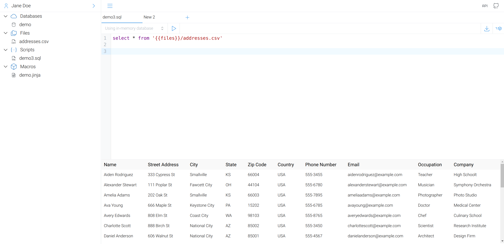

# OwlApp

Web based SQL query editor for your files, databases and cloud storage data.

Currently you can use it to query:
- Local files
- Cloud Storage Files (gcs, s3)
- Postgresql Database
- Duckdb Database

- You can create multiple users and each user can manage their user space (databases, connections, etc..)
- Has builtin user authentication and google oauth support.

- You can also upload files and query them.

## Installation

```sh
# Requires python >=3.12
pip install owlapp
```

## Quick Start

Start with basic options.

```sh
# create a directory in your favorite place like ~/projects/owlapp
mkdir ~/projects/owlapp && cd ~/projects/owlapp

# Create a virtual environment
python -m venv .venv && source .venv/bin/activate

# Install owlapp
pip install owlapp

# Initialize it with basic settings
owl init all

# Run it
owl run
```

- Run the following command see command line usage.

```sh
owl --help
```




See `.env` file for configuration options.

## Usage

### Databases

You can create as many databases as you want. If you didn't create any database then
an `in memory database` will be used for your queries. In memory database will only execute
`SELECT` queries. Other statement types are not supported.

### Querying uploaded files

You can query the files using the following pattern:
```sql
-- example
-- if you have uploaded a file named `addresses.csv`
-- you can query it using the following query;
select * from '{{files}}/addresses.csv'
```
`{{files}}` are the base path of the uploaded files.

### Macros

You can create macros and use default macros on the sql scripts. Example to default macros are;

- `{{files}}` which resolves to data files base path
- `{{ref('script_name_without_extension')}}` which resolves to a sub-query that is the content of the script.

```sql

-- Example to {{files}}
select * from '{{files}}/addresses.csv''
-- Assuming you have a uploaded a data file named `addresses.csv`
-- Above script will resolve to the path of that file and will be something like;
-- select * from 'path/to/data-files/addresses.csv''

-- Example to {{ref}}
-- * Given that you have defined a macro like this in the `Macros` section in any file.:

  'Hello, {{ name }}!'

-- * Given you have script file named 'demo.sql' which contains the following.
select {{ greet('Alice')}} as Greet, t.* from '{{files}}/addresses.csv' as t

-- * Given you have another script which contains the following SQL expression.
select * from {{ref('demo')}}

-- This will resolve to
select * from
    (select
  'Hello, Alice!'
 as Greet, t.* from 'path/to/data-files/addresses.csv' as t)
```


